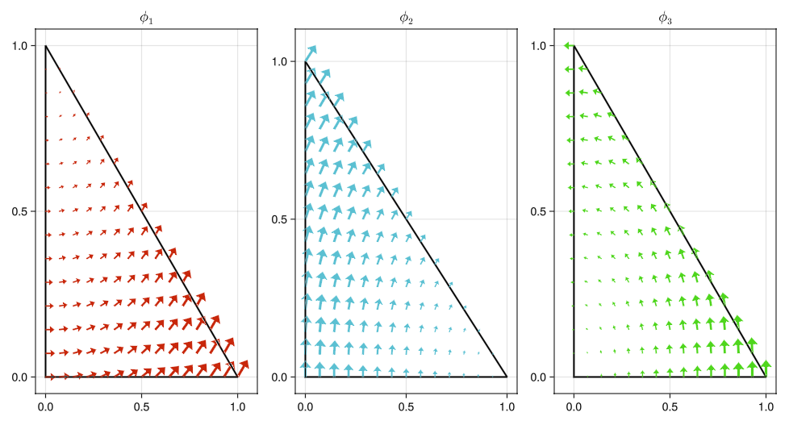
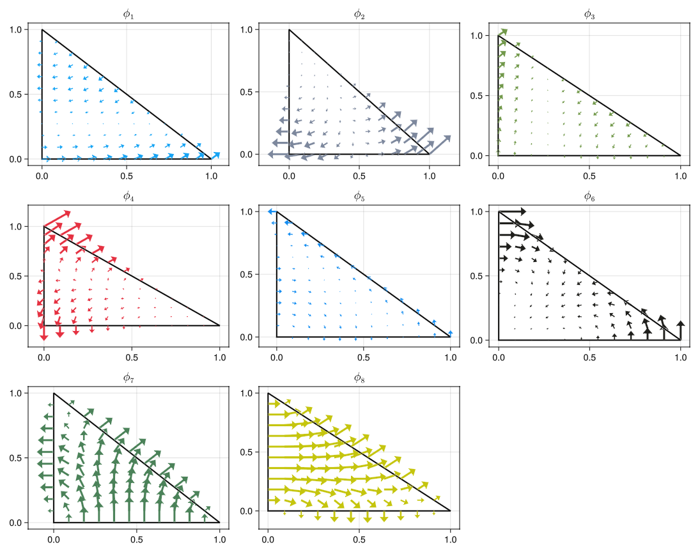

# symbolic-nedelec-experiments

> Not a package. Not a guide. Just me being curious about how one could get **explicit** Nédélec basis functions with **Symbolics.jl** tools in Julia.

The expressions seem to make sense (compared against [DefElement: Nédélec 1](https://defelement.org/elements/nedelec1.html)), but I’m only have user-level knowledge of FEM, so **I cannot guarantee that they are correct**. You can interpret this simply as notes I took while studying the subject.

If you notice any errors, please let me know, as there may be something I haven't noticed or haven't understood correctly.

# Why?

I was curious to see what I could do with symbolic computation, and I took the opportunity to explore a topic I didn't know much about.

I know that FEM libraries like deal.II or Gridap don't use explicit expressions but more flexible approaches for different element types and refinements. 

# Workflow

The implementation follows these steps:

1. **Space Definition**  

Define the polynomial space $R_k$ for first-type Nédélec elements on triangular reference elements, following definitions from [DefElement.org](https://defelement.org/elements/nedelec1.html) and https://www.dealii.org/reports/nedelec/nedelec.pdf.

The space is
```math
R_k = \mathcal{P}_{k-1}^2 \;\oplus\; \mathcal{S}_k, 
```

where:

   - $\mathcal{P}_{k-1}$ are vector-valued polynomials of degree $\leq k-1$.


   - $\mathcal{S}_k = \{ \mathbf{p} \in \tilde{\mathcal{P}}_k^d  : \mathbf{p}\cdot \mathbf{x} = 0 \}$.


  with $\tilde{\mathcal{P}}_k^d$ the vector polynomials of degree $k$.

2. **Symbolic Representation**  

Represent the basis with symbolic coefficients $c_{ij}$ and monomial terms $\varphi_{ij}$.  

The general form is:

$$ 
   \mathbf{N} = \sum_{i,j} c_{ij} \varphi_{ij}.
$$

3. **Moment Calculation**  

Compute **moments** (degrees of freedom) symbolically:

> I have chosen these types of polynomials, but it is possible to use others as long as they belong to the corresponding spaces.

**Edges:** For each edge, the tangential component is integrated against **Legendre polynomials**.

For an edge $e$ with tangent vector $\mathbf{t}$, a basis function $\mathbf{N}$, and a Legendre polynomial $L_m$ of degree $\leq k-1$.

$$\text{DOF}_{e,m}(\mathbf{N}) = \int_e (\mathbf{N} \cdot \mathbf{t}) L_m \, ds.$$

**Faces (for higher-order elements):** On the triangular face, the components are integrated against **Dubiner polynomials**, which form an orthogonal basis on the reference triangle.

For a face $f$ of the reference triangle, using a Dubiner polynomial $D_{mn}(s,t)$ of degree $\leq k-2$,

```math
\text{DOF}_{f,mn}(\mathbf{N}) = \int_f \mathbf{N} \cdot \mathbf{q} \, D_{mn}(s,t) \, dA
```

where $\mathbf{q}$ is an appropriate test direction.


4. **System Solving**  

For each DOF, assemble the linear system:
$$ \mathbf{A} \cdot \mathbf{c} = \mathbf{b},$$

where $\mathbf{b}$ has a single $1$ at the index of the active DOF and $0$ elsewhere. $\mathbf{A}$ is the matrix formed with the Symbolic equations from step **3**. 

This ensures each basis function activates exactly one degree of freedom.

5. **Basis Construction**  

Substitute the solved coefficients $\mathbf{c}$ back into the polynomial space to obtain the **explicit symbolic expression** for each basis function.


# Examples

For example, `N1k(0)` computes the Degree 0 Nèdelec of first kind on a triangle.

```julia
include("./symbolic-nedelec-experiments.jl")
N0 = N1k(0)

julia> N0 = N1k(0)
3-element Vector{Vector{SymbolicUtils.BasicSymbolic{Real}}}:
 [1.0 - u[2], u[1]]
 [u[2], 1.0 - u[1]]
 [-u[2], u[1]]

to_latex_string(N0)

julia> to_latex_string(N0)
\begin{array}{c} \phi_{1} =\left[\begin{array}{c}1 - y \\x \\\end{array}\right] \\
\phi_{2} =\left[\begin{array}{c}y \\1 - x \\\end{array}\right] \\
\phi_{3} =\left[\begin{array}{c} - y \\x \\\end{array}\right] \\
\end{array}
```

```math
\begin{array}{c} \phi_1 =\left[\begin{array}{c}1 - y \\x \\\end{array}\right] \\
\phi_2 =\left[\begin{array}{c}y \\1 - x \\\end{array}\right] \\
\phi_3 =\left[\begin{array}{c} - y \\x \\\end{array}\right] \\
\end{array}
```




The results are similar to the ones in https://defelement.org/elements/examples/triangle-nedelec1-legendre-0.html


```julia
N1 = N1k(1)

julia> N1 = N1k(1)
8-element Vector{Vector{SymbolicUtils.BasicSymbolic{Real}}}:
 [(1//1) - (5//1)*u[2] + (4//1)*(u[2]^2), u[1] - (4//1)*u[1]*u[2]]
 [-(3//1) + (6//1)*u[1] + (7//1)*u[2] - (8//1)*u[1]*u[2] - (4//1)*(u[2]^2), -(5//1)*u[1] + (8//1)*(u[1]^2) + (4//1)*u[1]*u[2]]
 [u[2] - (4//1)*u[1]*u[2], (1//1) - (5//1)*u[1] + (4//1)*(u[1]^2)]
 [-(5//1)*u[2] + (4//1)*u[1]*u[2] + (8//1)*(u[2]^2), -(3//1) + (7//1)*u[1] + (6//1)*u[2] - (4//1)*(u[1]^2) - (8//1)*u[1]*u[2]]
 [(3//1)*u[2] - (4//1)*u[1]*u[2] - (4//1)*(u[2]^2), -(3//1)*u[1] + (4//1)*(u[1]^2) + (4//1)*u[1]*u[2]]
 [-u[2] - (4//1)*u[1]*u[2] + (4//1)*(u[2]^2), -u[1] + (4//1)*(u[1]^2) - (4//1)*u[1]*u[2]]
 [-(8//1)*u[2] + (16//1)*u[1]*u[2] + (8//1)*(u[2]^2), (16//1)*u[1] - (16//1)*(u[1]^2) - (8//1)*u[1]*u[2]]
 [(16//1)*u[2] - (8//1)*u[1]*u[2] - (16//1)*(u[2]^2), -(8//1)*u[1] + (8//1)*(u[1]^2) + (16//1)*u[1]*u[2]]

to_latex_string(N1)

julia> to_latex_string(N1)
\begin{array}{c} \phi_{1} =\left[\begin{array}{c}1 - 5 y + 4 y^{2} \\x - 4 x y \\\end{array}\right] \\
\phi_{2} =\left[\begin{array}{c}-3 + 6 x + 7 y - 8 x y - 4 y^{2} \\ - 5 x + 8 x^{2} + 4 x y \\\end{array}\right] \\
\phi_{3} =\left[\begin{array}{c}y - 4 x y \\1 - 5 x + 4 x^{2} \\\end{array}\right] \\
\phi_{4} =\left[\begin{array}{c} - 5 y + 4 x y + 8 y^{2} \\-3 + 7 x + 6 y - 4 x^{2} - 8 x y \\\end{array}\right] \\
\phi_{5} =\left[\begin{array}{c}3 y - 4 x y - 4 y^{2} \\ - 3 x + 4 x^{2} + 4 x y \\\end{array}\right] \\
\phi_{6} =\left[\begin{array}{c} - y - 4 x y + 4 y^{2} \\ - x + 4 x^{2} - 4 x y \\\end{array}\right] \\
\phi_{7} =\left[\begin{array}{c} - 8 y + 16 x y + 8 y^{2} \\16 x - 16 x^{2} - 8 x y \\\end{array}\right] \\
\phi_{8} =\left[\begin{array}{c}16 y - 8 x y - 16 y^{2} \\ - 8 x + 8 x^{2} + 16 x y \\\end{array}\right] \\
\end{array}
```

```math
\begin{array}{c} \phi_1 =\left[\begin{array}{c}1 - 5 y + 4 y^{2} \\x - 4 x y \\\end{array}\right] \\
\phi_2 =\left[\begin{array}{c}-3 + 6 x + 7 y - 8 x y - 4 y^{2} \\ - 5 x + 8 x^{2} + 4 x y \\\end{array}\right] \\
\phi_3 =\left[\begin{array}{c}y - 4 x y \\1 - 5 x + 4 x^{2} \\\end{array}\right] \\
\phi_4 =\left[\begin{array}{c} - 5 y + 4 x y + 8 y^{2} \\-3 + 7 x + 6 y - 4 x^{2} - 8 x y \\\end{array}\right] \\
\phi_5 =\left[\begin{array}{c}3 y - 4 x y - 4 y^{2} \\ - 3 x + 4 x^{2} + 4 x y \\\end{array}\right] \\
\phi_6 =\left[\begin{array}{c} - y - 4 x y + 4 y^{2} \\ - x + 4 x^{2} - 4 x y \\\end{array}\right] \\
\phi_7 =\left[\begin{array}{c} - 8 y + 16 x y + 8 y^{2} \\16 x - 16 x^{2} - 8 x y \\\end{array}\right] \\
\phi_8 =\left[\begin{array}{c}16 y - 8 x y - 16 y^{2} \\ - 8 x + 8 x^{2} + 16 x y \\\end{array}\right] \\
\end{array}
```



Again, the basis functions are compared with the reference https://defelement.org/elements/examples/triangle-nedelec1-legendre-1.html, 

The order of the basis functions are equivalent to the DefElement functions with subindex [4, 5, 2, 3, 0, 1, 7, 6].

Basis functions $\phi_1$ to $\phi_5$ and $\phi_7$ to $\phi_8$ match DefElement's exactly in structure and sign.
Basis function $\phi_6$ corresponds to DefElement's $\phi_1$ multiplied by $-1$.

All functions are generated without normalization factors (i.e., without $\sqrt{3}/3$ or $\sqrt{2}$ scaling used in DefElement's orthonormalized version).
